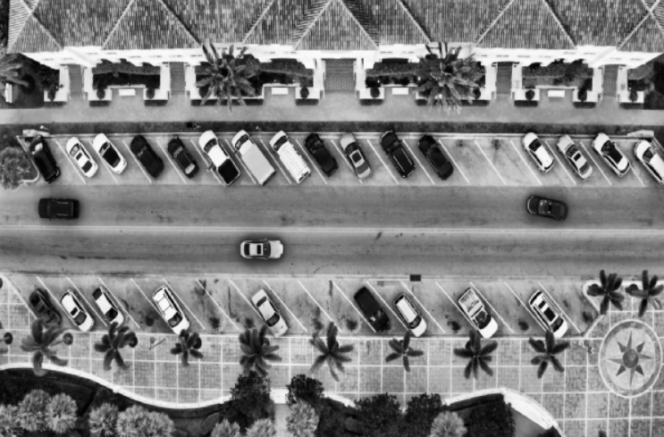
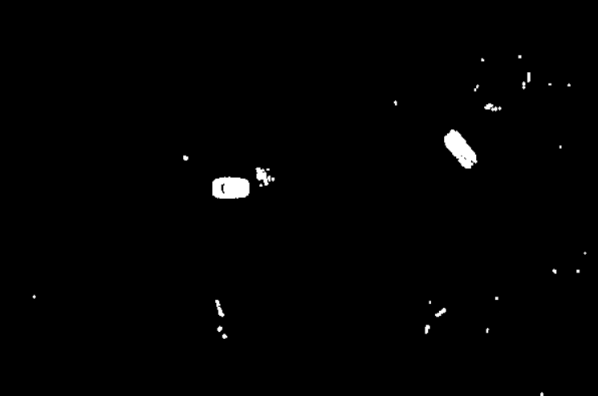
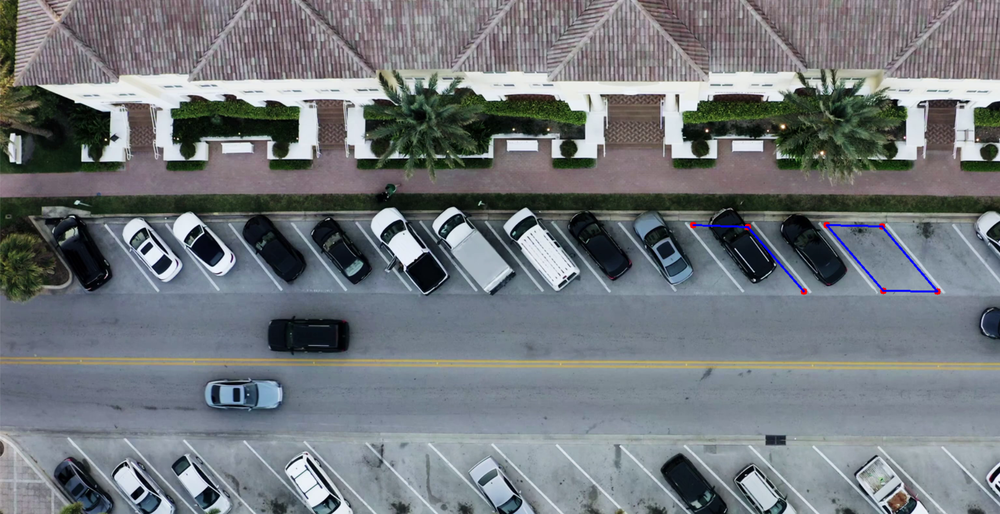
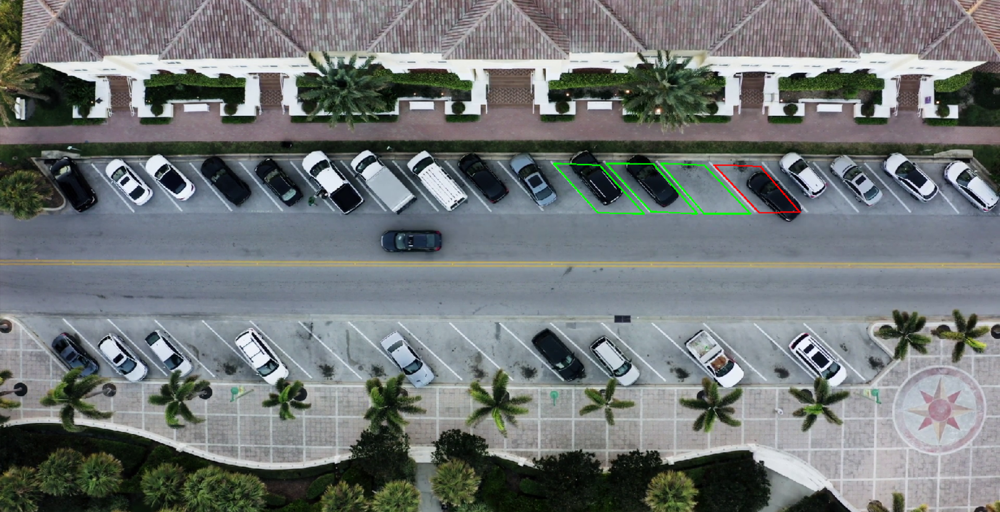

# 🚗 Parking spot Detection System using Computer Vision


This project aims to detect empty and occupied parking spaces using CCTV video feeds using classical computer vision techniques (no deep learning).

The system processes video frames, detects foreground objects (vehicles), and will further classify parking slots as occupied or vacant.

---

## STEP 1: VIDEO PREPROCESSING

This step performs basic preprocessing on video frames.

### Approach

- Convert frames to grayscale
- Apply CLAHE (Contrast Limited Adaptive Histogram Equalization) for contrast enhancement
- Apply Gaussian blur to reduce noise

### Output

- Original video frames
- Processed frames (grayscale + contrast enhanced + blurred)


### Files

- `main.py`: Runs the video loop and displays frames
- `preprocess.py`: Implements the preprocessing pipeline
- `videos/`: Contains input video (`video1.mp4`)

---

## STEP 2: BACKGROUND SUBTRACTION

This step detects moving objects (vehicles) using classical computer vision.

### Approach

- Uses MOG2 background subtraction
- Applies thresholding to remove shadows
- Applies morphological operations (opening and dilation) to remove noise

### Output

- Foreground mask:
  - White pixels represent moving objects (vehicles)
  - Black pixels represent background


### Files

- `background_subtraction.py`: Implements foreground detection
- Updated `main.py`: Integrates preprocessing with background subtraction

---

## STEP 3: PARKING SLOT DETECTION

This step detects parking slot occupancy using Region of Interest (ROI) based analysis.

### Approach

- Parking slots are manually defined using a click-based annotation tool
- Each slot is represented as a polygon (4 points)
- A mask is created for each slot region
- Foreground pixels inside each slot are analyzed
- If pixel density exceeds a threshold, the slot is marked as occupied

### Output

- Parking slots are drawn on the frame:
  - Green: Empty
  - Red: Occupied



- ⚠️Current issue to be fixed:
  - Shows green if a car already present
  - Turns red only when a car is moving into the spot and turns green again when the car stops 

### Files

- `slot_annotation.py`: Tool to annotate parking slots
- `slots.json`: Stores slot coordinates
- Updated `main.py`: Performs occupancy detection

---

## REQUIREMENTS

- Python 3.x
- OpenCV (`opencv-python`)

Install dependencies:

```bash
pip install opencv-python
```

---

## USAGE

1. Place your video file in:

```
videos/video1.mp4
```
2. Run the slot annotation tool

```bash
python slot_annotation.py
```

3. Run the program:

```bash
python main.py
```

4. Controls:
- Press `s` to save the slots
- Press `r` to reset the slots
- Press `q` to quit

---